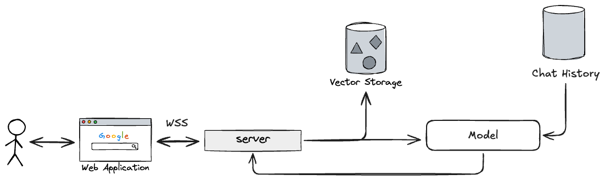
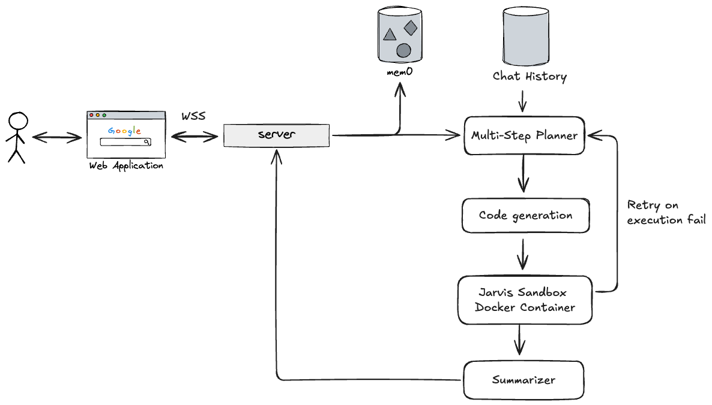
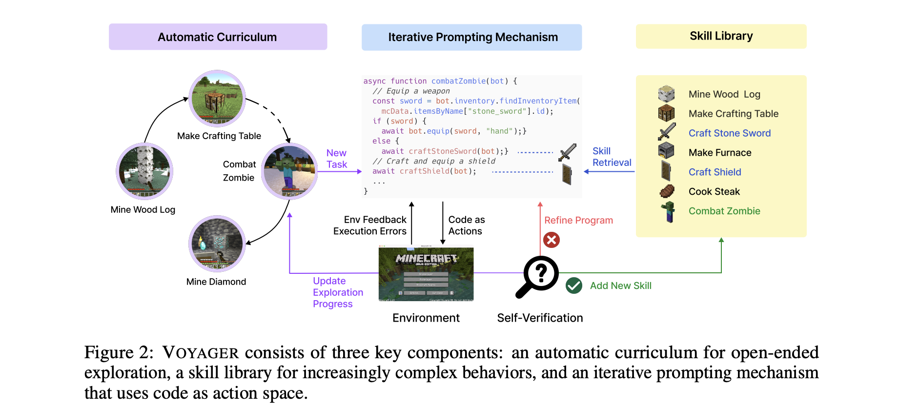
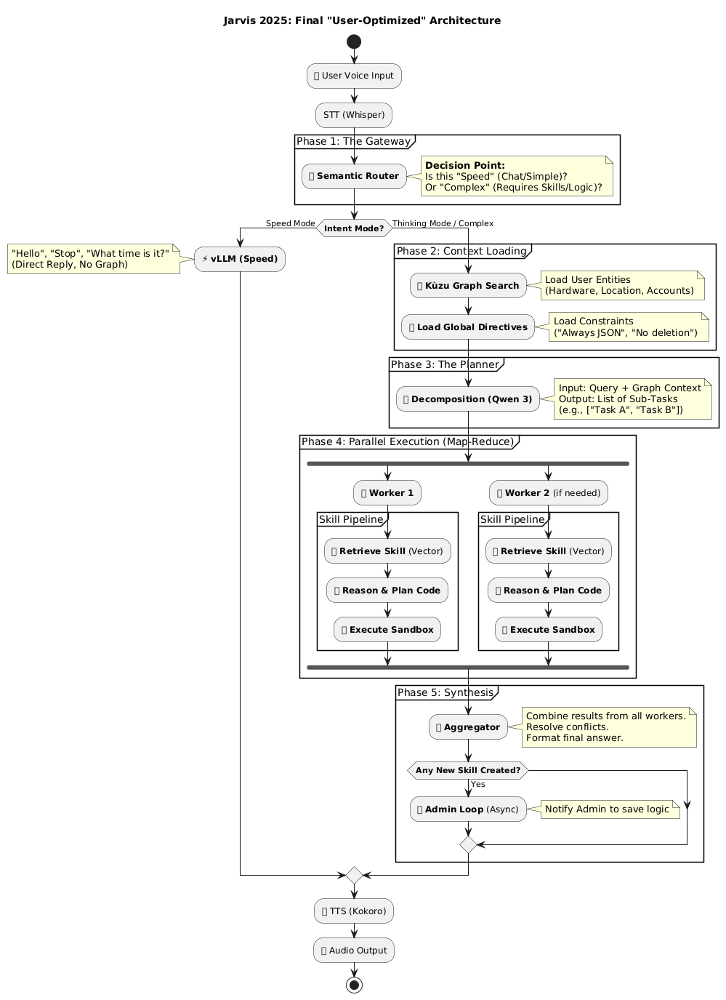
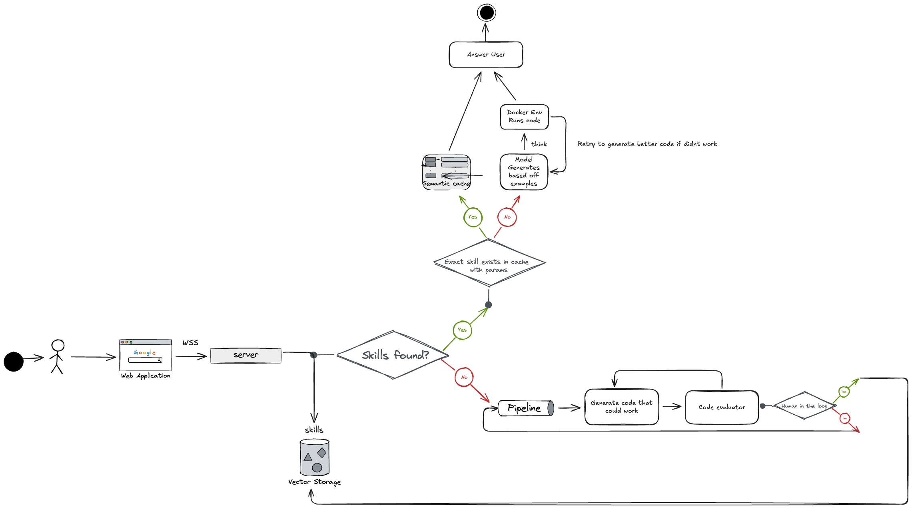

# Jarvis


[](https://opensource.org/licenses/MIT)
[](https://www.python.org/)

<p align="center">
  <strong>From Chatbot to Large Action Model (LAM): The Journey of an Autonomous Agent.</strong>
</p>

## Table of Contents
- [Overview](#overview)
- [The Evolution](#the-evolution)
  - [Eve v1: The Foundation](#eve-v1-the-foundation)
  - [Eve v2: The Thinker](#eve-v2-the-thinker)
  - [Jarvis: The Agent (Current)](#jarvis-the-agent-current)
- [Research & Inspiration](#research--inspiration)
- [Architecture & Deployment](#architecture--deployment)
- [Features](#features)
- [Getting Started](#getting-started)
- [License](#license)

## Overview

Jarvis represents the third iteration of my personal AI assistant, tracing its development from a basic chatbot to a sophisticated Large Action Model (LAM). Capable of understanding complex intentions, formulating multi-step plans, and executing them autonomously within a secure, sandboxed environment, Jarvis is designed to manage its own memory and actively achieve its objectives.

## The Evolution

My journey in developing AI assistants has progressed through three distinct phases, each addressing and improving upon the architectural limitations of its predecessor.

### Eve v1: The Foundation  
**Status:** Deprecated

Eve v1 marked my initial attempt at creating a voice assistant. During this early stage, the project adopted a "pure code" philosophy: every behavior was explicitly programmed, and all interactions relied on predetermined logic coupled with direct API calls.

Developing the system primarily in Python provided a sense of direct control and transparency. The architecture treated the Large Language Model (LLM) as a stateless component; each request involved injecting the entire conversational context along with a description of available tools. Conceptually, this design appeared straightforward.

However, practical constraints quickly became apparent once the system was deployed and actively used.

#### Approach & Limitations
Eve v1 utilized a basic implementation of the Model Context Protocol (MCP). Initially, I anticipated that a powerful GPU (RTX 5070 Ti) and a substantial 16k token context window would be sufficient. Nevertheless, chat history expanded rapidly, leading to a linear increase in token consumption with every interaction. As the input prompt grew in size, response latency significantly increased, and the system's overall responsiveness diminished.

To mitigate this, I experimented with summarizing previous responses into concise bullet points. While this approach reduced token usage, it often compromised conversational nuance and continuity. Furthermore, the execution flow was strictly linear, lacking any inherent capacity for advanced planning or handling multi-step tasks. Consequently, complex operations proved largely impractical to execute reliably.

**Key Technology:** Python, Qdrant (for vector storage), Qwen2.5-7B-Instruct (as the language model).



### Eve v2: The Thinker  
**Status:** Deprecated

Eve v2 introduced a fundamental shift: the integration of "thinking" capabilities. Rather than adhering to purely imperative logic, I transitioned to a recursive, LLM-driven execution loop, enabling the agent to "reason" and reflect upon its actions, often employing a "Chain of Thought" process.

Two pivotal developments influenced this version:
1.  **Adoption of LangChain:** Although initially cautious about relying on external frameworks, LangChain proved indispensable. It greatly facilitated the construction of structured reasoning processes and enhanced the modularity of the system.
2.  **Memory as a Core Component:** My understanding of state management evolved significantly after studying the research paper *Mem0: Building Production-Ready AI Agents with Scalable Long-Term Memory*. This inspired a departure from simple sliding windows toward a more structured memory pipeline: **summarize new information → extract new memories → perform memory operations (add, update, or delete)**.

#### Advancements in Code Execution
A second critical insight emerged from Anthropic's research on [MCP and code execution](https://www.anthropic.com/engineering/code-execution-with-mcp) and the paper [Executable Code Actions Elicit Better LLM Agents](https://arxiv.org/pdf/2402.01030).

This research highlighted a key limitation of schema-based tool calls: verbose tool descriptions could lead to context dilution. Their proposed solution—delegating tool usage to executable code—proved transformative. By empowering the LLM to directly generate Python scripts, I achieved significantly improved token efficiency and operational flexibility. To ensure safety, I established a dedicated, isolated execution environment, a Docker container named `jarvis-sandbox`, for running this generated code.

#### Key Limitations
Despite these notable improvements, Eve v2 still contended with reliability issues. Generated code often proved inconsistent, and the recursive "Chain of Thought" frequently exhausted retry limits, leading to task failures and increased latency for the user. While the system could now engage in reasoning, it lacked the necessary coordination and concurrency to effectively manage intricate, non-linear workflows.



### Jarvis: The Agent (Current)
**Status:** Active

Jarvis embodies the concept of an embodied, self-learning agent. Its architectural design was significantly influenced by the paper [Voyager: An Open-Ended Embodied Agent with Large Language Models](https://arxiv.org/pdf/2305.16291), which detailed an agent capable of evolving its skills within a Minecraft environment.



The primary challenge I aimed to address was **skill acquisition**. As a solo developer, manually coding every potential capability for Jarvis is impractical. Instead, Jarvis is designed to learn autonomously. Adapting the Voyager philosophy, Jarvis generates its own specialized code snippets (skills) through iterative trial and error. Successful executions are subsequently indexed and stored in a library for future retrieval and application.

Further insights were drawn from [OS-Copilot: Towards Generalist Computer Agents with Self-Improvement](https://arxiv.org/pdf/2402.07456), which facilitated the adaptation of skill learning principles from a game environment to a general-purpose operating system context.

#### Approach
Jarvis employs a fundamentally different architectural approach:
1.  **Semantic Skill Library:** Skills are no longer rigid functions but are vectorized and stored in a database, allowing for intelligent retrieval based on task requirements.
2.  **Intelligent Routing:** The system adeptly distinguishes between routine conversational queries and complex, goal-oriented tasks (e.g., "Generate a Monte Carlo Simulation"). It then dynamically routes the request through appropriate execution paths, which may involve parallel processing or iterative exploration within the sandbox.
3.  **Graph-Based Memory (Kuzu):** Building upon the relational aspects highlighted in the Mem0 paper, I integrated **Kuzu**, a knowledge graph database. This enables Jarvis to map and understand semantic relationships between entities, providing a more profound level of contextual awareness.



## Research & Inspiration

This project is deeply indebted to the foundational work of numerous researchers. The architecture of Jarvis represents a synthesis of key concepts derived from the following influential papers:

*   **[Mem0: Building Production-Ready AI Agents with Scalable Long-Term Memory](https://arxiv.org/abs/2407.15392)**  
    This paper provided the core theoretical framework for Jarvis's memory system, emphasizing the crucial distinction between transient conversational context and persistent, evolvable semantic knowledge.

*   **[Voyager: An Open-Ended Embodied Agent with Large Language Models](https://arxiv.org/pdf/2305.16291)**  
    The concept of a dynamic "Skill Library," where an agent autonomously develops, verifies, and stores its own executable code for subsequent application, was a direct adaptation from this seminal work.

*   **[OS-Copilot: Towards Generalist Computer Agents with Self-Improvement](https://arxiv.org/pdf/2402.07456)**  
    This research was instrumental in bridging the conceptual gap between game-centric agents (like Voyager) and the requirements for an agent operating within a general-purpose computer environment.

*   **[Executable Code Actions Elicit Better LLM Agents](https://arxiv.org/pdf/2402.01030)**  
    This study validated the efficacy of shifting from declarative, JSON-based tool calls to direct Python code execution, demonstrating superior reliability and enhanced token efficiency for LLM agents.

*   **[Anthropic: Code Execution with MCP](https://www.anthropic.com/engineering/code-execution-with-mcp)**  
    This article critically analyzed the limitations inherent in traditional Model Context Protocol (MCP) schemas and advocated for sandboxed code execution as a more robust and flexible interface for tool interaction.

## Architecture & Deployment

Jarvis operates on a modular architecture meticulously engineered for both scalability and security.

### Core Components
-   **Orchestrator:** This component is responsible for managing the overall state, directing the flow of interactions, and guiding Jarvis's deliberative processes.
-   **Memory (Mem0 + Kuzu):** A hybrid memory system integrating vector-based retrieval for semantic search with a knowledge graph database (Kuzu) for mapping and understanding intricate entity relationships.
-   **Sandbox:** An isolated Docker container designated for the secure and ephemeral execution of all generated code, thereby safeguarding the host system.
-   **Skills Library:** A dynamic repository containing a collection of successfully learned and verified code snippets (skills) available for future deployment.



## Features

-   **Voice-to-Text (STT):** High-fidelity transcription of spoken language leveraging Whisper technology.
-   **Language Model (LLM):** Utilizes local inference models such as vLLM (Qwen/Llama) to power its cognitive functions.
-   **Text-to-Speech (TTS):** Natural-sounding speech synthesis provided by Kokoro.
-   **Deep Research:** Capable of conducting iterative, autonomous web searching and information extraction.
-   **Code Execution:** Secure execution of Python code within its sandbox for data analysis and complex task automation.
-   **Modular Design:** Features a highly adaptable architecture with swappable adapters for core components including LLMs, Memory systems, and various Tools.

## Getting Started
  
### Prerequisites

-   Python 3.10+
-   Docker & Docker Compose
-   Pip

### Installation

1.  **Clone the repository:**
    ```bash
    git clone https://github.com/Thanh-Huy1104/jarvis.git
    cd jarvis
    ```
2.  **Install the dependencies:**
    ```bash
    pip install -r requirements.txt
    ```
3.  **Start the Sandbox:**
    ```bash
    docker compose up -d
    ```

### Running the Application

To initiate the desktop server:

```bash
python -m uvicorn app.main:app --host 0.0.0.0 --port 8080 --reload
 ```

## License

This project is licensed under the MIT License. Please refer to the `LICENSE` file for complete details.
